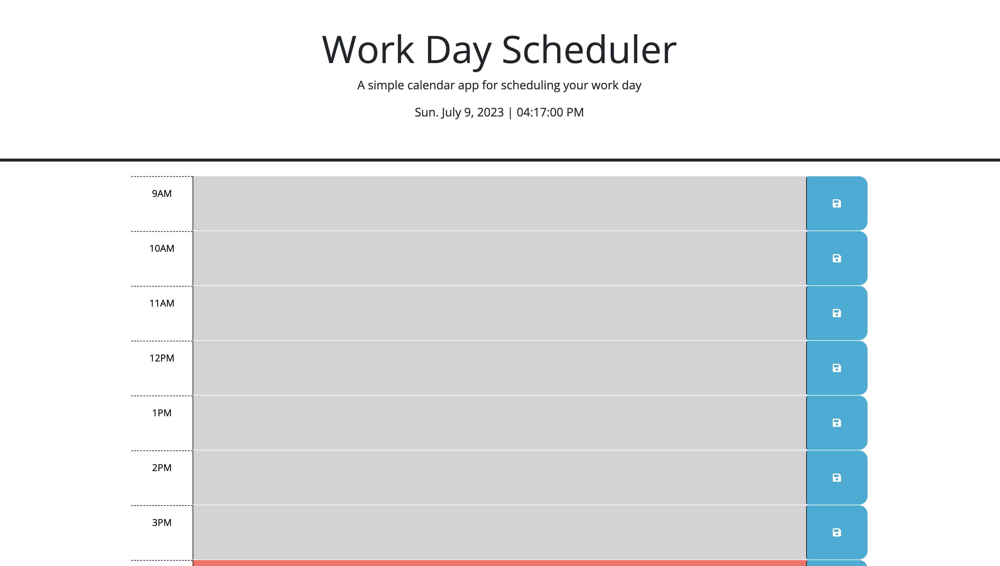
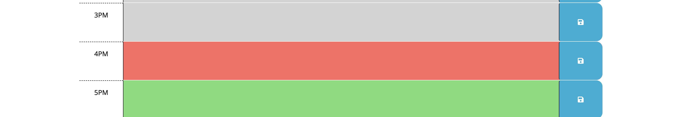
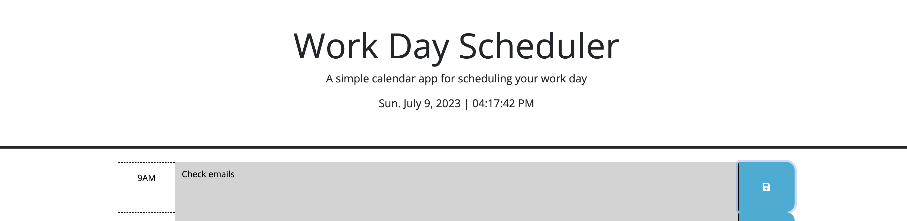

# Third-Party API - WorkDayScheduler

## Acceptance Criteria

```
GIVEN I am using a daily planner to create a schedule
WHEN I open the planner
THEN the current day is displayed at the top of the calendar
WHEN I scroll down
THEN I am presented with timeblocks for standard business hours of 9am&ndash;5pm
WHEN I view the timeblocks for that day
THEN each timeblock is color coded to indicate whether it is in the past, present, or future
WHEN I click into a timeblock
THEN I can enter an event
WHEN I click the save button for that timeblock
THEN the text for that event is saved in local storage
WHEN I refresh the page
THEN the saved events persist
```

## Usage

* This webpage can be used to generate items on one's schedule within the hours of 9am to 5pm.

* Link: https://candaceg00.github.io/TPAPI_WorkDayScheduler/

* Screenshots:
    
    
    


## Credits

* I worked on this project with some assistance from classmate Edward Kim.